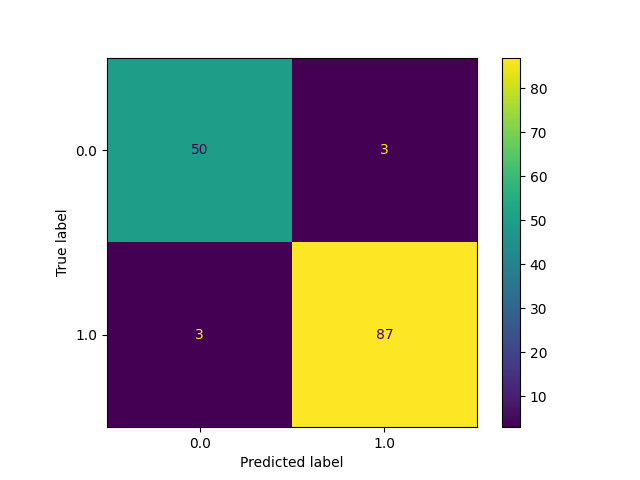
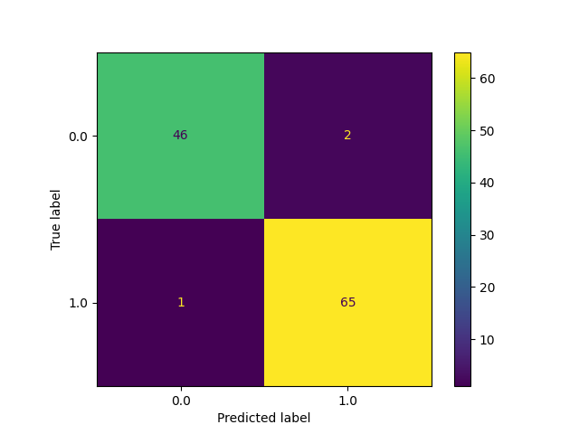

# Breast Cancer Classification
## Case Study
A key challenge in cancer detection is how to classify a tumor as malignant or benign.
By using machine learning we are able to predict if a tumor is malignant or benign
based on several observations/key features. for this case study the data set is compromised
of 30 features (see examples below).
  - radius (mean of distances from center to points on the perimeter)
  - texture (standard deviation of gray-scale values)
  - perimeter
  - area
  - smoothness (local variation in radius lengths)
  - compactness (perimeter^2 / area - 1.0)
  - concavity (severity of concave portions of the contour)
  - concave points (number of concave portions of the contour)
  - symmetry 
  - fractal dimension ("coastline approximation" - 1)

Number of Instances: 569

Class Distribution: 212 Malignant, 357 Benign

Target class:
   - Malignant
   - Benign

## Objective
Find the best machine learning classification model to predict whether a tumor will
be malignant or benign. 

## Test Setup
The data was first visualized using scatter plots, and a heat map in order to get
a high level understanding of any relationships between the features. Then, different
machine learning models for classification were used to narrow down the best model
that showed the best results (see list of models below).
* Logistic Regression
* Support Vector Machine (SVM)
* Kernel Support Vector Machine
* Naive Bayes
* Decision Tree Classification
* Random Forest Classification
* Xgboost
* Catboost

Each model used standardization for feature scaling, confusion matrix 
and k-fold cross validation. 

## Conclusion
After testing all the above classifications models it was narrowed down
to logistical regression and SVM.  
**Logistical Regression Results:**  
Confusion Matrix:  
  
K-Fold Cross Validation:  
Accuracy: 98.13 %  
Standard Deviation: 2.52 %  
Recall: 94% for Malignant detection  
Percision: 94% for Malignant detection 

**SVM with Grid Search Results:**  
Best Parameters:  
{'C': 0.25, 'kernel': 'linear'}  
Confusion Matrix:  
  
K-Fold Cross Validation  
Accuracy: 98.25 %  
Standard Deviation: 1.91 %  
Recall: 96% for Malignant detection  
Percision: 98% for Malignant detection

Comparing the two models the best choice would be SVM because we have a recall of 96% compared to a 
recall of 94% for logistical regression. In this case we want a high recall because it indicates that we had less
type II errors. The type II error would mean we are predicting a tumor is Benign when it is really Malignant.
type I errors are better than type II errors in this case and we want to minimize the type II errors.
It is better to predict a tumor is malignant and do more tests on the tumor rather than think it is
benign and do nothing. So, the best model in this case would be SVM.

## References
This database is also available through the UW CS ftp server:

ftp ftp.cs.wisc.edu
cd math-prog/cpo-dataset/machine-learn/WDBC/

   - W.N. Street, W.H. Wolberg and O.L. Mangasarian. Nuclear feature extraction 
     for breast tumor diagnosis. IS&T/SPIE 1993 International Symposium on 
     Electronic Imaging: Science and Technology, volume 1905, pages 861-870,
     San Jose, CA, 1993.
   - O.L. Mangasarian, W.N. Street and W.H. Wolberg. Breast cancer diagnosis and 
     prognosis via linear programming. Operations Research, 43(4), pages 570-577, 
     July-August 1995.
   - W.H. Wolberg, W.N. Street, and O.L. Mangasarian. Machine learning techniques
     to diagnose breast cancer from fine-needle aspirates. Cancer Letters 77 (1994) 
     163-171.
